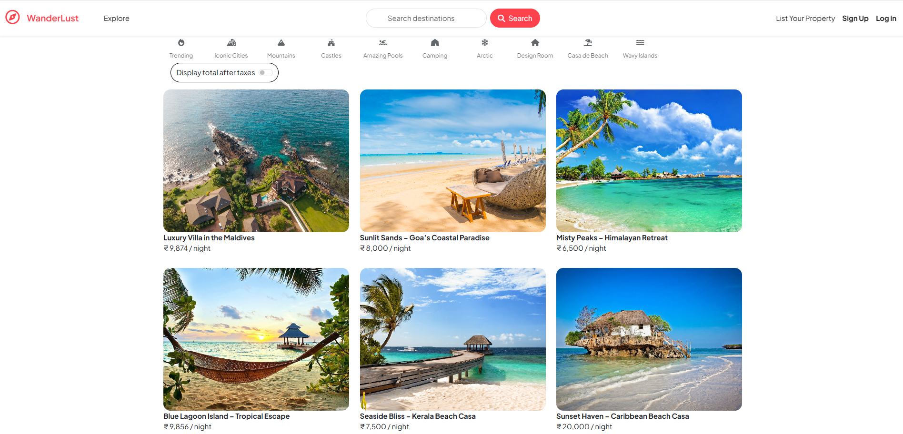
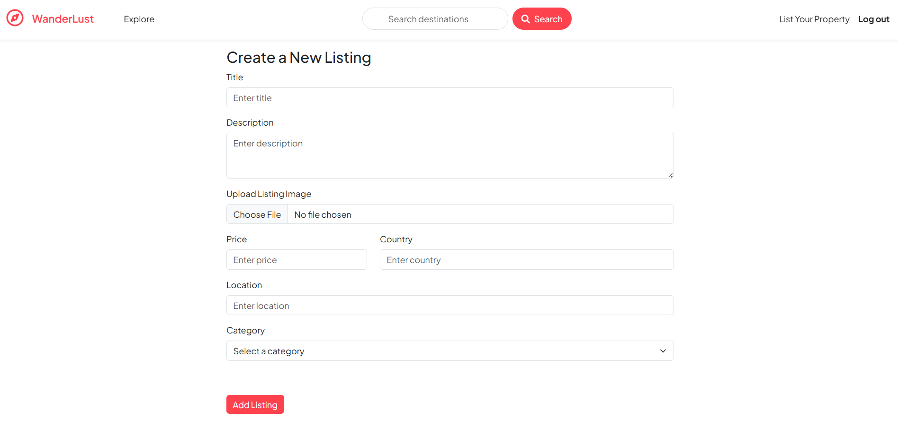
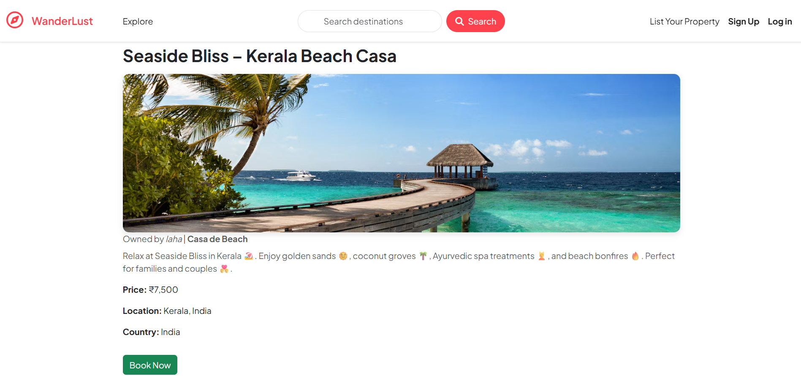
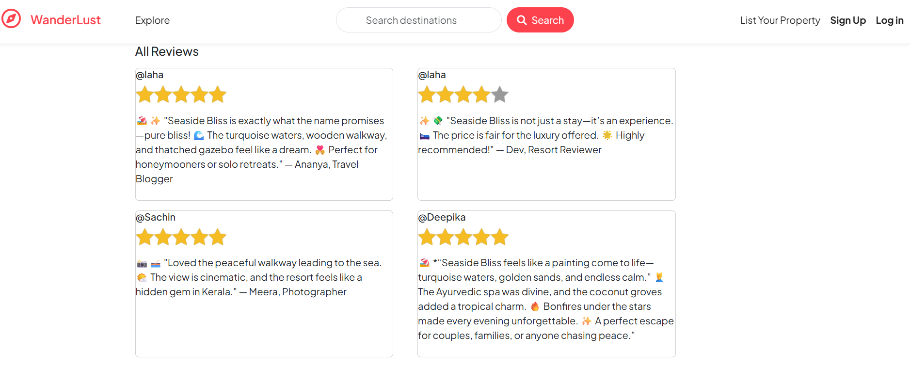
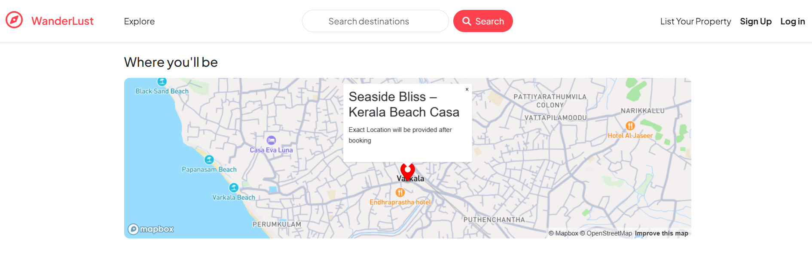
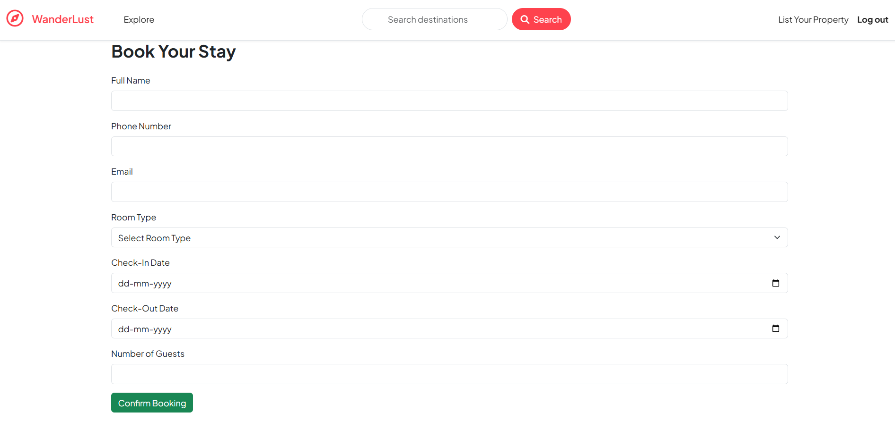

# 🌍 WonderLust 🏡  
A Full-Stack Travel & Stay Platform inspired by Airbnb.


---

## 🚀 Live Demo  
🔗 [Live Project Link](https://wanderlust-travel-kq1k.onrender.com/listings)  
🔗 [GitHub Repository](https://github.com/SaumikLaha/Wanderlust-Travel)

---

## 📌 Description  
**WonderLust** is a complete travel booking web application where users can:
- 🏡 A Full-Stack Travel & Stay Platform inspired by Airbnb.
- 🏡 Explore beautiful listings across different categories  
- 📍 View properties with interactive maps (MapBox integration)  
- ✍️ Manage their own listings (Add, Edit, Delete)  
- 🖼️ Upload property images securely with Cloudinary  
- 💬 Review & rate properties  

This project follows a scalable MVC architecture and is built for real-world deployment.

---

## ⚙️ Features  

✅ User Authentication (Sign Up, Login, Logout using Passport.js)  
✅ Secure password hashing with bcrypt  
✅ Add, Edit, and Delete property listings  
✅ Cloudinary-powered Image Uploads  
✅ Interactive Map with MapBox  
✅ Category-based Filtering  
✅ Review & Rating System  
✅ Flash Messages & Form Validation  
✅ Booking Feature with Availability  
✅ Fully Responsive UI  

---

## 🛠 Tech Stack  

| Layer         | Technologies Used                     |
|---------------|----------------------------------------|
| **Frontend**  | HTML5, CSS3, JavaScript, EJS           |
| **Backend**   | Node.js, Express.js                    |
| **Database**  | MongoDB, Mongoose                      |
| **Auth**      | Passport.js                            |
| **Image Host**| Cloudinary                             |
| **Maps**      | MapBox                                 |

---

## 📷 Screenshots  

### 1️⃣ Home Page  


### 2️⃣ Listings Page  


### 3️⃣ Property Details Page  


### 4️⃣ Review Section  


### 5️⃣ Property Location in Map (MapBox)  


### 6️⃣ Booking Page  


---

## ⚡ Installation & Setup  

```bash
# 1️⃣ Clone repository
git clone https://github.com/SaumikLaha/Wanderlust-Travel

# 2️⃣ Go to project folder
cd Wanderlust-Travel

# 3️⃣ Install dependencies
npm install

# 4️⃣ Add environment variables
touch .env
# MongoDB Atlas Connection
ATLASDB_URL=your_mongodb_uri

# Cloudinary Credentials
CLOUDINARY_CLOUD_NAME=your_cloud_name
CLOUDINARY_API_KEY=your_api_key
CLOUDINARY_API_SECRET=your_api_secret

# MapBox Token
MAPBOX_TOKEN=your_mapbox_token

# Session Secret
SECRET=your_session_secret
# Start server
node app.js

# OR for development
nodemon app.js
## ✨ Author  
👨‍💻 **Saumik Laha**  
🔗 [GitHub Profile](https://github.com/SaumikLaha)
